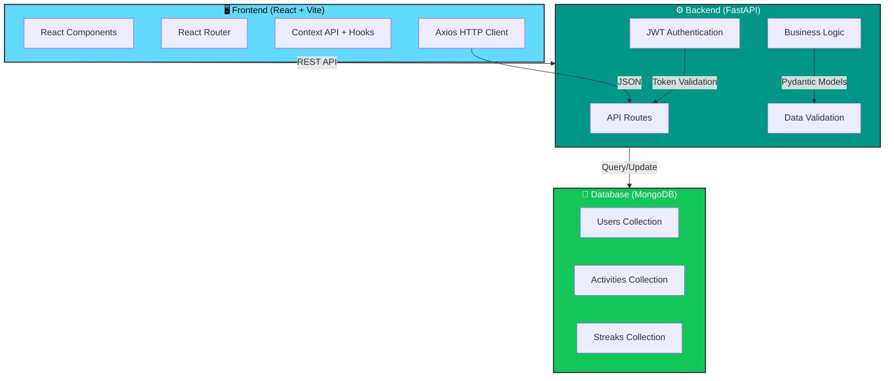
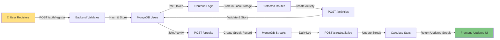
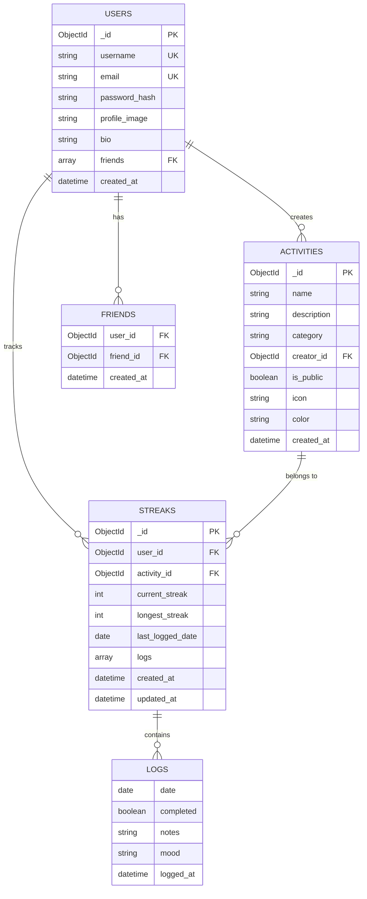
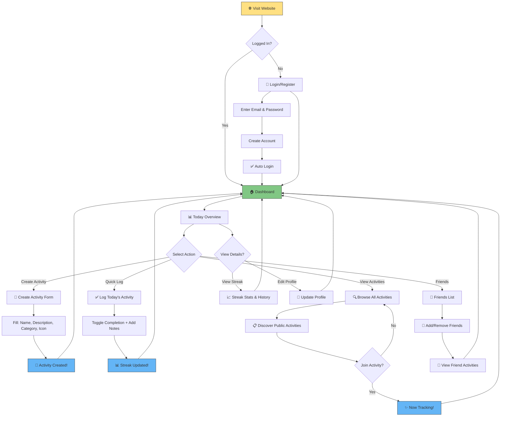
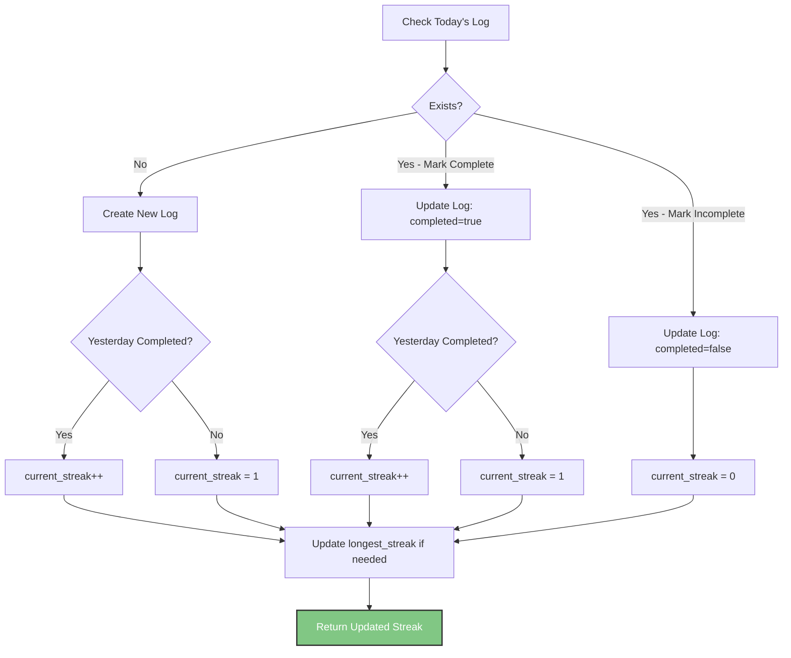

# 🔥 Activity Streak Tracker

> **Build habits, track progress, stay accountable with friends. A lightweight, modern web app for activity streaks and habit tracking.**

[](https://opensource.org/licenses/MIT)
[](https://www.python.org/downloads/)
[](https://nodejs.org/)
[](https://fastapi.tiangolo.com/)
[](https://react.dev/)
[](https://www.mongodb.com/)

---

## 🎯 Project Overview

Activity Streak Tracker is a **minimal, delightful, and powerful** habit tracking application designed for individuals and friend groups to build consistent habits together. Whether you're into fitness, learning, creative pursuits, or personal development—this app makes it fun and social.

### Why Activity Streak Tracker?

- 🎯 **Dead Simple**: Create activity, log daily, watch the streak grow
- 🔥 **Motivating**: Visual streak counters with fire emojis keep you going
- 👥 **Social**: Share activities with friends and stay accountable together
- 📱 **Mobile-First**: Responsive design that works beautifully on all devices
- ⚡ **Lightning Fast**: Lightweight architecture means zero lag
- 🎨 **Modern UI**: Clean, intuitive interface that feels delightful to use
- 🚀 **Production Ready**: Docker support, proper error handling, fully tested

---

## 📊 System Architecture



---

## 🏗️ High-Level Data Flow



---

## ✨ Features at a Glance

### 🎯 Core Features

| Feature | Description | Status |
|---------|-------------|--------|
| **User Authentication** | Secure email/password registration & login | ✅ MVP |
| **Activity Management** | Create, discover, and manage activities | ✅ MVP |
| **Daily Logging** | Quick one-click logging with optional notes | ✅ MVP |
| **Streak Tracking** | Automatic streak calculation & visualization | ✅ MVP |
| **Friends System** | Add friends and view their activities | ✅ Phase 2 |
| **Activity Feed** | Discover trending and public activities | ✅ Phase 2 |
| **User Profiles** | Customizable profile with bio and stats | ✅ Phase 2 |
| **Statistics Dashboard** | Detailed streak stats and insights | ✅ Phase 3 |
| **Calendar View** | Visual history of activity logs | 📅 Phase 3 |
| **Achievements** | Badges and milestones | 🚀 Phase 4 |
| **Dark Mode** | Toggleable dark theme | 🎨 Phase 4 |

---

## 🗂️ Database Schema



---

## 🚀 Quick Start Guide

### Prerequisites

Ensure you have installed:
- **Python 3.10+** ([Download](https://www.python.org/downloads/))
- **Node.js 18+** ([Download](https://nodejs.org/))
- **MongoDB 5.0+** ([Download](https://www.mongodb.com/try/download/community) or use [MongoDB Atlas](https://www.mongodb.com/cloud/atlas))
- **Git** ([Download](https://git-scm.com/))

### 📦 Installation

#### 1️⃣ Clone the Repository

```bash
git clone https://github.com/yourusername/activity-streak-tracker.git
cd activity-streak-tracker
```

#### 2️⃣ Backend Setup

```bash
# Navigate to backend directory
cd backend

# Create virtual environment
python -m venv venv

# Activate virtual environment
# On macOS/Linux:
source venv/bin/activate
# On Windows:
venv\Scripts\activate

# Install dependencies
pip install -r requirements.txt

# Create environment file
cp .env.example .env

# Edit .env with your MongoDB URI and JWT secret
nano .env  # or your preferred editor

# Run the backend server
uvicorn app.main:app --reload --host 0.0.0.0 --port 8000
```

Backend will be available at: `http://localhost:8000`

API Documentation: `http://localhost:8000/docs`

#### 3️⃣ Frontend Setup

```bash
# Navigate to frontend directory
cd ../frontend

# Install dependencies
npm install

# Create environment file
cp .env.local.example .env.local

# Add your backend API URL
# VITE_API_URL=http://localhost:8000

# Start development server
npm run dev
```

Frontend will be available at: `http://localhost:5173`

#### 4️⃣ MongoDB Setup (if using locally)

```bash
# Option 1: Using Docker
docker run -d -p 27017:27017 --name mongodb mongo:latest

# Option 2: Manual installation
# Follow https://docs.mongodb.com/manual/installation/

# Option 3: MongoDB Atlas (Cloud)
# Create free account at https://www.mongodb.com/cloud/atlas
```

### ✅ Verify Installation

```bash
# Test Backend API
curl http://localhost:8000/docs

# Test Frontend
# Open http://localhost:5173 in your browser
```

---

## 📁 Project Structure

```
activity-streak-tracker/
│
├── backend/
│   ├── app/
│   │   ├── __init__.py
│   │   ├── main.py                    # FastAPI app initialization
│   │   ├── config.py                  # Configuration & environment
│   │   │
│   │   ├── models/
│   │   │   ├── user.py               # User MongoDB model
│   │   │   ├── activity.py           # Activity MongoDB model
│   │   │   └── streak.py             # Streak MongoDB model
│   │   │
│   │   ├── schemas/
│   │   │   ├── user.py               # Pydantic validation schemas
│   │   │   ├── activity.py
│   │   │   ├── streak.py
│   │   │   └── base.py               # Base response schemas
│   │   │
│   │   ├── routes/
│   │   │   ├── auth.py               # Authentication endpoints
│   │   │   ├── activities.py         # Activity CRUD endpoints
│   │   │   ├── streaks.py            # Streak & logging endpoints
│   │   │   ├── users.py              # User management endpoints
│   │   │   ├── friends.py            # Friend system endpoints
│   │   │   └── dashboard.py          # Dashboard & stats endpoints
│   │   │
│   │   ├── utils/
│   │   │   ├── auth.py               # JWT & password utilities
│   │   │   ├── database.py           # MongoDB connection
│   │   │   ├── dependencies.py       # FastAPI dependencies
│   │   │   └── helpers.py            # Helper functions
│   │   │
│   │   └── middleware/
│   │       ├── auth.py               # Authentication middleware
│   │       ├── cors.py               # CORS configuration
│   │       └── error.py              # Error handling
│   │
│   ├── requirements.txt               # Python dependencies
│   ├── .env.example                   # Environment template
│   ├── Dockerfile                     # Docker configuration
│   ├── docker-compose.yml             # Docker Compose setup
│   └── README.md                      # Backend documentation
│
├── frontend/
│   ├── src/
│   │   ├── components/
│   │   │   ├── Auth/
│   │   │   │   ├── LoginForm.jsx
│   │   │   │   ├── RegisterForm.jsx
│   │   │   │   └── ProtectedRoute.jsx
│   │   │   │
│   │   │   ├── Activity/
│   │   │   │   ├── ActivityCard.jsx
│   │   │   │   ├── ActivityForm.jsx
│   │   │   │   ├── ActivityList.jsx
│   │   │   │   └── ActivityDetails.jsx
│   │   │   │
│   │   │   ├── Streak/
│   │   │   │   ├── StreakCard.jsx
│   │   │   │   ├── LogEntryForm.jsx
│   │   │   │   ├── StreakStats.jsx
│   │   │   │   └── CalendarView.jsx
│   │   │   │
│   │   │   ├── Dashboard/
│   │   │   │   ├── TodayOverview.jsx
│   │   │   │   ├── QuickLog.jsx
│   │   │   │   ├── FriendFeed.jsx
│   │   │   │   └── TrendingActivities.jsx
│   │   │   │
│   │   │   ├── Common/
│   │   │   │   ├── Navbar.jsx
│   │   │   │   ├── Modal.jsx
│   │   │   │   ├── Toast.jsx
│   │   │   │   └── LoadingSpinner.jsx
│   │   │   │
│   │   │   └── Layout/
│   │   │       └── MainLayout.jsx
│   │   │
│   │   ├── pages/
│   │   │   ├── Home.jsx
│   │   │   ├── Dashboard.jsx
│   │   │   ├── Activities.jsx
│   │   │   ├── MyStreaks.jsx
│   │   │   ├── Friends.jsx
│   │   │   ├── Profile.jsx
│   │   │   ├── ActivityDetail.jsx
│   │   │   └── NotFound.jsx
│   │   │
│   │   ├── hooks/
│   │   │   ├── useAuth.js
│   │   │   ├── useActivities.js
│   │   │   ├── useStreaks.js
│   │   │   └── useApi.js
│   │   │
│   │   ├── context/
│   │   │   ├── AuthContext.jsx
│   │   │   └── NotificationContext.jsx
│   │   │
│   │   ├── utils/
│   │   │   ├── api.js              # Axios setup & interceptors
│   │   │   ├── dates.js            # Date utilities
│   │   │   ├── formatters.js       # Data formatters
│   │   │   └── validators.js       # Input validation
│   │   │
│   │   ├── styles/
│   │   │   ├── index.css
│   │   │   ├── tailwind.css
│   │   │   └── animations.css
│   │   │
│   │   ├── App.jsx
│   │   └── main.jsx
│   │
│   ├── public/
│   │   ├── favicon.svg
│   │   └── images/
│   │
│   ├── package.json
│   ├── .env.local.example
│   ├── vite.config.js
│   ├── tailwind.config.js
│   ├── postcss.config.js
│   ├── Dockerfile
│   └── README.md
│
├── docker-compose.yml                # Full stack Docker setup
├── .gitignore
├── LICENSE
└── README.md                         # This file
```

---

## 🔌 API Endpoints Reference

### Authentication

```
POST   /api/auth/register       Register new user
POST   /api/auth/login          Login with credentials
POST   /api/auth/refresh        Refresh JWT token
GET    /api/auth/me             Get current user profile
POST   /api/auth/logout         Logout user
```

### Activities

```
POST   /api/activities          Create new activity
GET    /api/activities          Get all public activities (paginated)
GET    /api/activities/:id      Get activity details
PUT    /api/activities/:id      Update activity (owner only)
DELETE /api/activities/:id      Delete activity (owner only)
GET    /api/activities/search   Search activities by name
GET    /api/activities/trending Get trending activities
GET    /api/activities/category/:cat Get activities by category
```

### Streaks & Logging

```
POST   /api/streaks             Join an activity (create streak)
GET    /api/streaks             Get all streaks for current user
GET    /api/streaks/:id         Get specific streak details
DELETE /api/streaks/:id         Stop tracking activity
POST   /api/streaks/:id/log     Log activity for today
GET    /api/streaks/:id/logs    Get all logs for a streak
PUT    /api/streaks/:id/logs/:date Update past log entry
```

### Friends & Social

```
GET    /api/users/search        Search users by username
GET    /api/users/:id           Get user profile
PUT    /api/users/:id           Update user profile
POST   /api/users/:id/friends   Add friend
DELETE /api/users/:id/friends   Remove friend
GET    /api/users/:id/friends   Get user's friends list
```

### Dashboard & Analytics

```
GET    /api/dashboard/today     Get today's activities status
GET    /api/dashboard/summary   Get user's streak statistics
GET    /api/dashboard/friends   Get friend activity feed
GET    /api/dashboard/leaderboard Get friend leaderboard
```

📚 **Full API Documentation**: Available at `http://localhost:8000/docs` (Swagger UI)

---

## 🔄 User Flow Diagram



---

## 🛠️ Technology Stack

### Frontend
```
✨ React 18+              - Modern UI library
🛣️  React Router v6      - Client-side routing
🎯 Axios                 - HTTP client with interceptors
🌈 Tailwind CSS          - Utility-first styling
📅 date-fns              - Lightweight date utilities
✔️  Zod / Yup            - Form validation
🎣 React Hooks           - State management
⚡ Vite                  - Lightning-fast build tool
```

### Backend
```
🚀 FastAPI               - Modern Python web framework
⚙️  Uvicorn              - ASGI server
🔐 Python-jose           - JWT token handling
🔒 Passlib + Bcrypt      - Password hashing
📦 Motor                 - Async MongoDB driver
✔️  Pydantic             - Data validation
🌐 CORS                  - Cross-origin handling
📝 SQLAlchemy (optional) - For advanced queries
```

### Database
```
🌿 MongoDB               - NoSQL document database
📋 Collections: Users, Activities, Streaks, Logs
🔑 Proper indexing for performance
```

### DevOps & Deployment
```
🐳 Docker                - Containerization
📦 Docker Compose        - Multi-container setup
☁️  Vercel/Netlify       - Frontend hosting
☁️  Render/Railway       - Backend hosting
☁️  MongoDB Atlas        - Cloud database
```

---

## 📊 Streak Calculation Logic



---

## 🎯 Development Phases

```mermaid
timeline
    title Activity Streak Tracker - Development Roadmap
    
    section Phase 1: MVP (Week 1)
        Auth System
        Basic Activities CRUD
        Simple Daily Logging
        Dashboard with Today's View
        Streak Counter
    
    section Phase 2: Social (Week 2)
        Friend Management
        Public Activity Feed
        Join/Leave Activities
        Notes on Logs
        Streak Statistics
    
    section Phase 3: Polish (Week 3)
        Calendar View
        Activity Trending
        Profile Pages
        Search Functionality
        UI/UX Refinement
    
    section Phase 4: Gamification (Week 4+)
        Achievements & Badges
        Leaderboards
        Export Features
        Analytics Dashboard
        Dark Mode
```

---

## 🧪 Testing

### Backend Testing

```bash
# Install test dependencies
pip install pytest pytest-asyncio httpx

# Run tests
pytest app/tests/

# Run with coverage
pytest --cov=app app/tests/

# Run specific test
pytest app/tests/test_auth.py::test_register_user
```

### Frontend Testing

```bash
# Install test dependencies
npm install --save-dev vitest @testing-library/react

# Run tests
npm run test

# Run with coverage
npm run test:coverage

# Watch mode
npm run test:watch
```

### Manual API Testing

Use the interactive Swagger UI:
```
http://localhost:8000/docs
```

Or use Postman/Insomnia:
```
Import collection from: backend/postman_collection.json
```

---

## 🐳 Docker Deployment

### Single Container Deployment

#### Backend

```bash
cd backend
docker build -t activity-tracker-backend .
docker run -d -p 8000:8000 \
  -e MONGODB_URL="your-mongodb-uri" \
  -e JWT_SECRET="your-secret-key" \
  activity-tracker-backend
```

#### Frontend

```bash
cd frontend
docker build -t activity-tracker-frontend .
docker run -d -p 3000:3000 \
  -e VITE_API_URL="http://localhost:8000" \
  activity-tracker-frontend
```

### Full Stack with Docker Compose

```bash
# From root directory
docker-compose up -d

# View logs
docker-compose logs -f

# Stop containers
docker-compose down
```

---

## ☁️ Production Deployment

### Backend (Render.com)

1. Push code to GitHub
2. Connect repository to Render
3. Set environment variables
4. Deploy!

```yaml
# render.yaml
services:
  - type: web
    name: activity-tracker-api
    env: python
    buildCommand: pip install -r requirements.txt
    startCommand: uvicorn app.main:app --host 0.0.0.0
    envVars:
      - key: MONGODB_URL
        sync: false
      - key: JWT_SECRET
        sync: false
```

### Frontend (Vercel)

```bash
# Install Vercel CLI
npm i -g vercel

# Deploy
cd frontend
vercel deploy

# Set environment variables in Vercel dashboard
# VITE_API_URL=https://your-api-domain.com
```

### Database (MongoDB Atlas)

1. Create free account at https://www.mongodb.com/cloud/atlas
2. Create cluster
3. Get connection string
4. Add to `.env` files

---

## 🔒 Security Best Practices

- ✅ **Password Hashing**: bcrypt with salt rounds
- ✅ **JWT Tokens**: Secure token generation and validation
- ✅ **CORS**: Configured for specific origins
- ✅ **Input Validation**: Pydantic schemas on backend, form validation on frontend
- ✅ **SQL Injection**: MongoDB prevents traditional SQL injection
- ✅ **HTTPS**: Enforced in production
- ✅ **Environment Variables**: Secrets never committed to git
- ✅ **Rate Limiting**: Prevent API abuse (implement in production)
- ✅ **CSRF Protection**: Can be added to forms if needed

---

## 🐛 Troubleshooting

### Backend Issues

#### Port Already in Use
```bash
# Find process using port 8000
lsof -i :8000
# Kill process
kill -9 <PID>
```

#### MongoDB Connection Error
```bash
# Check MongoDB is running
# Local: mongod should be running
# Atlas: Check connection string in .env
# Whitelist your IP in MongoDB Atlas
```

#### JWT Token Expired
```
Error: "Could not validate credentials"
Solution: Token expires after 24 hours. 
User needs to login again or implement refresh tokens.
```

### Frontend Issues

#### CORS Error
```
Error: "Access to XMLHttpRequest blocked by CORS policy"
Solution: Backend CORS is not configured correctly.
Check app/middleware/cors.py and restart backend.
```

#### Blank Dashboard
```
Error: Activities not loading
Solution: 
1. Check network tab in DevTools
2. Verify backend is running: http://localhost:8000/docs
3. Check VITE_API_URL in .env.local
```

#### Build Errors
```bash
# Clear cache and reinstall
rm -rf node_modules package-lock.json
npm install
npm run build
```

---

## 📈 Performance Optimization

### Frontend
- 🎯 Code splitting with React.lazy()
- 📦 Memoization with React.memo
- 🗜️ Image optimization with next-gen formats
- ⚡ Lazy loading images
- 🔄 Caching with React Query/SWR

### Backend
- 🗄️ MongoDB indexing on frequently queried fields
- 📄 Pagination for large datasets
- ⚙️ Async/await for non-blocking operations
- 💾 Response caching for read-heavy endpoints

### Database
```javascript
// Create indices for performance
db.users.createIndex({ email: 1 })
db.users.createIndex({ username: 1 })
db.activities.createIndex({ creator_id: 1 })
db.streaks.createIndex({ user_id: 1, activity_id: 1 })
db.streaks.createIndex({ last_logged_date: 1 })
```

---

## 🤝 Contributing

We'd love your contributions! Here's how:

### 1. Fork the Repository
```bash
git clone https://github.com/yourusername/activity-streak-tracker.git
cd activity-streak-tracker
```

### 2. Create Feature Branch
```bash
git checkout -b feature/amazing-feature
```

### 3. Make Changes
- Write clean, readable code
- Follow PEP 8 (Python) and ESLint (JavaScript)
- Add tests for new features

### 4. Commit & Push
```bash
git add .
git commit -m "feat: add amazing feature"
git push origin feature/amazing-feature
```

### 5. Open Pull Request
- Describe your changes clearly
- Reference any related issues
- Wait for review and CI checks to pass

### Contribution Guidelines
- ✅ Keep PRs focused and small
- ✅ Write descriptive commit messages
- ✅ Update documentation
- ✅ Add tests for new features
- ✅ Follow existing code style

---

## 📋 Roadmap

### ✅ Completed
- [x] User authentication system
- [x] Activity CRUD operations
- [x] Daily logging with notes
- [x] Basic streak tracking
- [x] Dashboard overview
- [x] API documentation

### 🚧 In Progress
- [ ] Friend system
- [ ] Public activity feed
- [ ] User profiles
- [ ] Statistics dashboard

### 📅 Planned
- [ ] Calendar view
- [ ] Achievements/badges
- [ ] Leaderboards
- [ ] Dark mode
- [ ] Mobile app (React Native)
- [ ] Notifications
- [ ] Export features
- [ ] AI-powered insights

---

## 📞 Support & Community

- 📧 **Email**: support@activitytracker.dev
- 💬 **Discord**: [Join Community](https://discord.gg/activitytracker)
- 🐦 **Twitter**: [@ActivityTracker](https://twitter.com/activitytracker)
- 📖 **Documentation**: [Full Docs](https://docs.activitytracker.dev)
- 🐛 **Bug Reports**: [GitHub Issues](https://github.com/yourusername/activity-streak-tracker/issues)

---

## 📜 License

This project is licensed under the **MIT License** - see [LICENSE](LICENSE) file for details.

```
MIT License

Copyright (c) 2024 Activity Streak Tracker

Permission is hereby granted, free of charge, to any person obtaining a copy
of this software and associated documentation files (the "Software"), to deal
in the Software without restriction, including without limitation the rights
to use, copy, modify, merge, publish, distribute, sublicense, and/or sell
copies of the Software, and to permit persons to whom the Software is
furnished to do so, subject to the following conditions:

The above copyright notice and this permission notice shall be included in all
copies or substantial portions of the Software.
```

---

## 🙏 Acknowledgments

- [FastAPI](https://fastapi.tiangolo.com/) - Amazing Python framework
- [React](https://react.dev/) - Revolutionary UI library
- [MongoDB](https://www.mongodb.com/) - Flexible database
- [Tailwind CSS](https://tailwindcss.com/) - Utility-first styling
- All contributors who made this project possible

---

## ⭐ Show Your Support

If you find this project helpful, please:
- ⭐ **Star** this repository
- 🐦 **Share** on social media
- 🤝 **Contribute** improvements
- 📢 **Spread** the word

---

<div align="center">

### Made with ❤️ by the Activity Tracker Team

**[GitHub](https://github.com/yourusername/activity-streak-tracker)** • **[Live Demo](https://activity-tracker.vercel.app)** • **[Issues](https://github.com/yourusername/activity-streak-tracker/issues)**

</div>

---

## 📝 Changelog

### v1.0.0 (2024-01-15)
- 🎉 Initial release
- ✨ Core features implemented
- 📱 Mobile-responsive design
- 🚀 Production deployment ready

### v0.9.0 (2024-01-10)
- 🧪 Beta testing phase
- 🐛 Bug fixes and improvements

---

**Last Updated**: January 2024  
**Status**: ✅ Production Ready  
**Maintainer**: Activity Tracker Team
